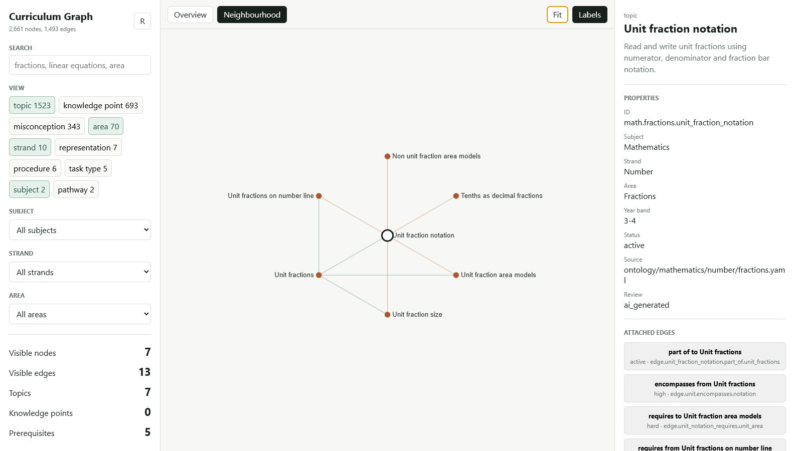

# Curriculum Graph

This repository contains a curriculum ontology and the tools I use to work on
it. The graph is stored as readable YAML; a TypeScript MCP server lets an LLM
search and validate it, and the local explorer makes the relationships easier
to inspect by hand.

The evolving graph has over 2,500 nodes and over 1,400 edges. Most of the
detailed work is in mathematics, with an early English scaffold. Topics can be
connected to prerequisites, smaller knowledge points, misconceptions,
representations and assessment task types.

> This is an alpha. Much of the ontology is still draft or AI-generated and has
> not been checked by a subject specialist. It should not be treated as teaching
> or assessment advice.



## What the graph is for

A flat list of curriculum outcomes does not say much about how ideas depend on
one another. The graph is meant to make questions like these inspectable:

- What does a learner need before tackling a topic?
- Which fine-grained knowledge points make up a broader skill?
- What downstream concepts may be affected by changing a prerequisite?
- Where are coverage gaps, orphans, duplicates, and cycles?
- Which misconceptions and representations attach to a topic?

## What is in the repository

- TypeScript MCP server with query, validation, patching, analysis, and export tools.
- Canonical YAML ontology designed to remain readable and reviewable in Git.
- Validation for IDs, edge semantics, duplicates, cycles, granularity, and year bands.
- Auditable patch logs instead of silent direct mutation.
- JSON, JSON-LD, and YAML exports.
- Dependency-free browser explorer backed by the canonical graph.
- Vitest coverage for validation, graph queries, and analysis behaviour.

## Quick start

Requires Node.js 20 or newer.

```bash
npm ci
npm test
npm run dev:web
```

Open `http://127.0.0.1:5177` to explore the graph.

For the local stdio MCP server:

```bash
npm run dev
```

The MCP server is read-only by default: an LLM can search and inspect the
ontology, run coverage and impact analysis, validate proposed patches, and use
the resources/prompts, but it is not offered the `apply_patch` mutation tool.
To work in an explicitly trusted authoring session, opt in before starting it:

```powershell
$env:CURRICULUM_GRAPH_ALLOW_WRITES = "true"
npm run dev
```

Other useful commands:

```bash
npm run lint        # TypeScript checks
npm run build       # Compile to dist/
npm run dev:http    # Streamable HTTP MCP server on localhost:3333
npm run export:json # Write generated/indexes/graph.json
```

## Architecture

```text
ontology/**/*.yaml ──> graph loader ──> in-memory index
                            │                 │
                            │                 ├── MCP query and analysis tools
                            │                 ├── local web explorer
patches/logs/*.json ─> validator/patcher      └── JSON / JSON-LD / YAML exports
```

The ontology is the source of truth. Generated indexes and build output are deliberately excluded from version control.

## Safe authoring flow

Agents and humans should inspect before writing:

1. `get_schema`
2. `get_area_map`
3. `search_nodes` or `find_similar_nodes`
4. `validate_patch`
5. `apply_patch`
6. `coverage_report`

Graph mutations should go through patches so proposed changes are validated and leave an audit trail.

## Why the data and tools are together

I have kept the YAML and the TypeScript tooling in one repository for now. That
way a schema or ontology change can be reviewed with the code that reads it. If
the ontology eventually needs its own release cycle, it can be pulled out as a
versioned data package. Read-only LLM access does not require a separate repo;
the MCP server already hides and rejects the mutation tool unless writes are
explicitly enabled.

## HTTP access and security

The HTTP server binds to `127.0.0.1` by default. Set `MCP_AUTH_TOKEN` before deliberately exposing it through a tunnel or reverse proxy. The token provides a basic bearer-auth boundary; this alpha has not received a security audit and should not be exposed as a long-running public service.

```powershell
$env:MCP_AUTH_TOKEN = "choose-a-long-random-token"
npm run dev:http
```

See [SECURITY.md](SECURITY.md) for the current threat boundary.

## Caveats

- The graph is a research and authoring artefact, not an endorsed curriculum.
- AI-generated metadata records provenance; it does not imply correctness.
- Curriculum alignment files are mappings and identifiers, not a claim of affiliation.
- Patch logs are retained because reproducibility is a core goal, although their format may change before v1.

## Roadmap

- Add structured human-review workflows and review dashboards.
- Expand deterministic quality and coverage reports.
- Improve layouts and filtering for large neighbourhoods.
- Add versioned ontology releases and stable export contracts.
- Complete resource responses that are placeholders in the v0 MCP surface.

See [CONTRIBUTING.md](CONTRIBUTING.md) if you want to work on it. Licensed under
the [MIT License](LICENSE).
