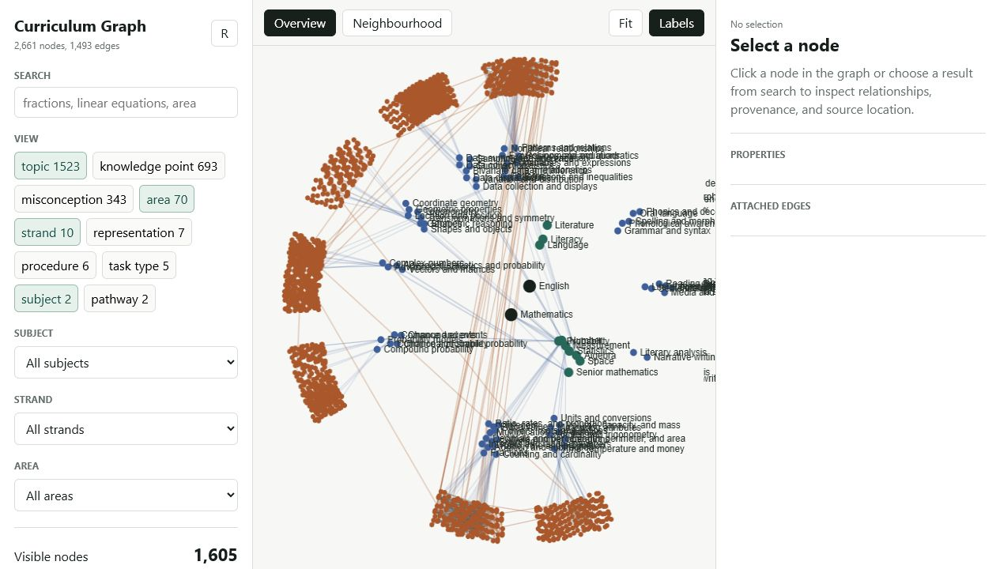

# Curriculum Graph

Curriculum Graph is an experimental, graph-aware authoring system for K-12 curriculum knowledge. It combines a human-readable YAML ontology, deterministic validation, an MCP server for agent-assisted editing, and a local explorer for inspecting relationships.

The current private alpha contains 2,661 nodes and 1,493 edges, led by a broad mathematics graph with an early English scaffold. It models topics, knowledge points, misconceptions, representations, procedures, pathways, and prerequisite relationships rather than treating curriculum as a flat list of outcomes.

> **Alpha status:** the software and ontology are works in progress. Content marked `draft` or `ai_generated` has not necessarily been reviewed by a subject specialist and should not be treated as teaching or assessment advice.



## Why a graph?

A graph can answer questions a document tree cannot answer cleanly:

- What does a learner need before tackling a topic?
- Which fine-grained knowledge points make up a broader skill?
- What downstream concepts may be affected by changing a prerequisite?
- Where are coverage gaps, orphans, duplicates, and cycles?
- Which misconceptions and representations attach to a topic?

## What is included

- TypeScript MCP server with query, validation, patching, analysis, and export tools.
- Canonical YAML ontology designed to remain readable and reviewable in Git.
- Validation for IDs, edge semantics, duplicates, cycles, granularity, and year bands.
- Auditable patch logs instead of silent direct mutation.
- JSON, JSON-LD, and YAML exports.
- Dependency-free browser explorer backed by the canonical graph.
- Vitest coverage for validation, graph queries, and analysis behaviour.

## Quick start

Requires Node.js 20 or newer.

```bash
npm ci
npm test
npm run dev:web
```

Open `http://127.0.0.1:5177` to explore the graph.

For the local stdio MCP server:

```bash
npm run dev
```

Other useful commands:

```bash
npm run lint        # TypeScript checks
npm run build       # Compile to dist/
npm run dev:http    # Streamable HTTP MCP server on localhost:3333
npm run export:json # Write generated/indexes/graph.json
```

## Architecture

```text
ontology/**/*.yaml ──> graph loader ──> in-memory index
                            │                 │
                            │                 ├── MCP query and analysis tools
                            │                 ├── local web explorer
patches/logs/*.json ─> validator/patcher      └── JSON / JSON-LD / YAML exports
```

The ontology is the source of truth. Generated indexes and build output are deliberately excluded from version control.

## Safe authoring flow

Agents and humans should inspect before writing:

1. `get_schema`
2. `get_area_map`
3. `search_nodes` or `find_similar_nodes`
4. `validate_patch`
5. `apply_patch`
6. `coverage_report`

Graph mutations should go through patches so proposed changes are validated and leave an audit trail.

## HTTP access and security

The HTTP server binds to `127.0.0.1` by default. Set `MCP_AUTH_TOKEN` before deliberately exposing it through a tunnel or reverse proxy. The token provides a basic bearer-auth boundary; this alpha has not received a security audit and should not be exposed as a long-running public service.

```powershell
$env:MCP_AUTH_TOKEN = "choose-a-long-random-token"
npm run dev:http
```

See [SECURITY.md](SECURITY.md) for the current threat boundary.

## Project boundaries

- The graph is a research and authoring artefact, not an endorsed curriculum.
- AI-generated metadata records provenance; it does not imply correctness.
- Curriculum alignment files are mappings and identifiers, not a claim of affiliation.
- Patch logs are retained because reproducibility is a core goal, although their format may change before v1.

## Roadmap

- Add structured human-review workflows and review dashboards.
- Expand deterministic quality and coverage reports.
- Improve layouts and filtering for large neighbourhoods.
- Add versioned ontology releases and stable export contracts.
- Complete resource responses that are placeholders in the v0 MCP surface.

Contributions are welcome after the repository becomes public; see [CONTRIBUTING.md](CONTRIBUTING.md). Licensed under the [MIT License](LICENSE).
